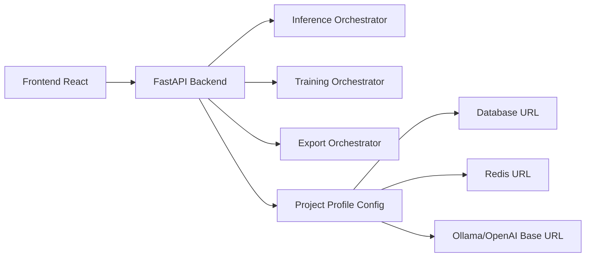

# HoweverUnsloth - 私有化模型训练与推理平台 | Private LLM Training & Inference Platform


🔥 Private LLM training and inference platform for local-first deployment.  
🚀 基于 Unsloth 做工程化二次改造，面向“可私有化、可配置、可维护”的团队落地。  
⭐ 覆盖模型训练、推理服务、数据配方、配置治理、依赖审计与仓库品牌化改造。

<p align="center">
  中文工程文档版本｜适合二开、课程项目、团队内部平台化改造
</p>

<p align="center">
  
  
  
  
  
</p>

---

## 目录

- [1. 项目定位](#1-项目定位)
- [2. 本次改造目标](#2-本次改造目标)
- [3. 已完成改造项](#3-已完成改造项)
- [4. 仓库结构](#4-仓库结构)
- [5. 快速开始](#5-快速开始)
- [6. 配置说明（数据库/Redis/Ollama/API）](#6-配置说明数据库redisollamaapi)
- [7. 依赖管理与升级建议](#7-依赖管理与升级建议)
- [8. 架构说明](#8-架构说明)
- [9. 与原版差异](#9-与原版差异)
- [10. 部署方式](#10-部署方式)
- [11. 仓库品牌与元信息设置](#11-仓库品牌与元信息设置)
- [12. 60条改造路线图](#12-60条改造路线图)
- [13. 协议与许可证](#13-协议与许可证)
- [14. 检测与测试](#14-检测与测试)
- [15. 常见问题](#15-常见问题)

---

## 1. 项目定位

`HoweverUnsloth` 是在 `Unsloth` 基础上进行私有化工程改造的版本，目标不是只保留“能跑通”的能力，而是形成可持续演进的团队工程底座。

核心定位：

1. 私有化部署优先：支持本地/内网部署与地址替换。
2. 配置治理优先：统一管理数据库、Redis、Ollama、OpenAI 兼容地址。
3. 二开维护优先：提供命名空间替换脚本与品牌化配置入口。
4. 文档化交付优先：README 与配套文档直接面向团队协作。

---

## 2. 本次改造目标

本轮改造围绕“把仓库变成自己的项目”执行以下目标：

1. 项目标识可配置：支持项目名、显示名、仓库描述、Topics 统一修改。
2. 敏感配置可替换：把常见地址与密钥从代码层迁移到环境变量。
3. 依赖治理可执行：新增依赖审计脚本，形成升级流程模板。
4. 改造过程可复用：提供批量命名替换脚本，兼容 Java/Python/前端文件。
5. 文档交付可直接使用：中文 README、协议文件、仓库元信息模板完整可用。

---

## 3. 已完成改造项

### 3.1 配置与后端能力

- 新增 `studio/backend/core/project_profile.py`：统一读取项目级配置。
- 新增 `GET /api/project-profile`：输出脱敏后的项目配置。
- `GET /api/health` 的 `service` 字段改为项目显示名。
- 启动 Banner 支持动态项目名，不再写死默认品牌文案。

### 3.2 私有化与品牌化

- 新增 `.env.project.example`：集中配置数据库、Redis、Ollama、OpenAI 地址。
- 新增 `docs/assets/howeverunsloth-logo.svg`：项目 Logo 资产。
- 新增 `docs/repo_profile_and_topics.md`：仓库描述与 GitHub Topics 设置方案。

### 3.3 工程脚本

- 新增 `scripts/project_customize.py`：批量替换项目名、namespace、groupId、artifactId。
- 新增 `scripts/run_studio_with_profile.sh`：按 profile 快速启动后端。
- 新增 `scripts/dependency_audit.sh`：依赖审计与升级流程提示。

### 3.4 文档与协议

- 重写 `README.md`（中文工程化文档）。
- 新增 `LICENSE.HOWEVER-COMMUNITY.md`（社区协作补充协议）。
- 新增 `docs/customization_plan_60.md`（60条改造路线图）。

---

## 4. 仓库结构

```text
.
├── README.md
├── pyproject.toml
├── .env.project.example
├── LICENSE.HOWEVER-COMMUNITY.md
├── scripts/
│   ├── project_customize.py
│   ├── run_studio_with_profile.sh
│   └── dependency_audit.sh
├── docs/
│   ├── customization_plan_60.md
│   ├── repo_profile_and_topics.md
│   └── assets/
│       └── howeverunsloth-logo.svg
├── studio/
│   ├── backend/
│   │   ├── main.py
│   │   ├── run.py
│   │   └── core/project_profile.py
│   └── frontend/
│       └── package.json
└── unsloth/
```

---

## 5. 快速开始

### 5.1 安装依赖

```bash
# Python
python3 -m venv .venv
source .venv/bin/activate
pip install -U pip
pip install -e .

# Frontend（可选）
cd studio/frontend
npm install
```

### 5.2 初始化项目配置

```bash
cd ..
cp .env.project.example .env.project
# 根据你的环境编辑 .env.project
```

### 5.3 启动

```bash
./scripts/run_studio_with_profile.sh .env.project
```

默认访问：

- `http://127.0.0.1:8888/`
- `http://127.0.0.1:8888/api/health`
- `http://127.0.0.1:8888/api/project-profile`

---

## 6. 配置说明（数据库/Redis/Ollama/API）

配置文件模板：`.env.project.example`

关键变量：

- `HOWEVER_DATABASE_URL`：数据库地址（默认 sqlite）
- `HOWEVER_REDIS_URL`：Redis 地址
- `HOWEVER_OLLAMA_BASE_URL`：Ollama 服务地址
- `HOWEVER_OPENAI_BASE_URL`：OpenAI 兼容 API 地址
- `HF_TOKEN` / `OPENAI_API_KEY` / `WANDB_API_KEY`：密钥类配置

建议：

1. 开发环境与生产环境分离配置文件。
2. 密钥通过 CI/CD Secret 注入，不提交到仓库。
3. 生产环境仅保留必要变量，减少误配置面。

---

## 7. 依赖管理与升级建议

### 7.1 快速审计

```bash
./scripts/dependency_audit.sh
```

### 7.2 升级策略

1. 先升级工具链（lint/test/build）再升级运行时。
2. 前端与后端依赖分批升级，避免一次性大变更。
3. GPU 相关依赖（torch/xformers/triton）必须做硬件矩阵验证。
4. 每次升级都要保留可回滚 tag。

---

## 8. 架构说明



本次重构重点是把“项目信息和环境地址”抽离为单一配置入口，降低多文件散落式改动成本。

---

## 9. 与原版差异

| 维度 | 原版 | 当前版本 |
|---|---|---|
| 项目定位 | 通用 Unsloth 主仓 | 私有化工程改造版本 |
| 配置入口 | 多处环境变量读取 | `project_profile` 统一收敛 |
| 品牌化 | 默认上游品牌 | 支持项目名/Logo/描述/Topics 自定义 |
| 文档语言 | 英文为主 | 中文工程文档为主 |
| 维护脚本 | 通用脚本 | 新增私有化替换、依赖审计、profile 启动脚本 |
| 协议文件 | 原许可证文本 | 新增社区协作补充协议 |

---

## 10. 部署方式

### 10.1 本地开发部署

- 适合功能联调与脚本验证。
- 使用 `.env.project` 管理本地地址。

### 10.2 内网服务部署

- 使用反向代理暴露统一入口。
- 将数据库/Redis/Ollama 指向内网服务。
- 密钥通过环境注入，不写入镜像层。

### 10.3 容器化部署（建议）

- 后端镜像与前端静态资源镜像分离。
- 启动时挂载 `.env.project` 或由编排系统注入变量。
- 配合健康检查与日志采集做服务治理。

---

## 11. 仓库品牌与元信息设置

请参考：`docs/repo_profile_and_topics.md`

包含：

- 推荐仓库描述
- 推荐 GitHub Topics
- `gh repo edit` 一键设置命令
- Logo 使用建议

---

## 12. 60条改造路线图

详见：`docs/customization_plan_60.md`
实施状态：`docs/customization_implementation_status.md`

该清单覆盖：

- 品牌化与命名空间
- 配置治理与敏感信息
- 依赖升级与供应链
- 代码重构与架构优化
- 功能增强
- 测试与发布
- 运维与合规

---

## 13. 协议与许可证

- 上游许可证：保留原仓库许可证要求。
- 本仓新增补充协议：`LICENSE.HOWEVER-COMMUNITY.md`

说明：补充协议用于规范新增私有化文件与协作流程，不替代原有开源许可证。

---

## 14. 检测与测试

推荐执行顺序：

```bash
# 1) 语法与脚本检查
python3 -m py_compile $(find studio/backend scripts -name '*.py')
bash -n scripts/*.sh

# 2) 品牌一致性与预检
python3 scripts/check_brand_consistency.py
./scripts/preflight_check.sh 8888

# 3) backend/studio 基线测试（无 torch/GPU 也可执行）
python3 -m pytest -q \
  studio/backend/tests \
  --ignore=studio/backend/tests/test_gpu_selection.py \
  --ignore=studio/backend/tests/test_gpu_selection_sandbox.py \
  -ra

# 4) GPU 逻辑独立测试（硬件无关）
python3 -m pytest -q \
  studio/backend/tests/test_gpu_selection.py \
  studio/backend/tests/test_gpu_selection_sandbox.py \
  -ra

# 5) 可选：GPU 运行时冒烟（仅 CUDA 机器）
python3 -m pytest -q \
  studio/backend/tests/test_utils.py::TestGpuMemoryInfo::test_cuda_memory_info_mocked \
  -ra
```

---

## 15. 常见问题

### Q1：我只想替换名字，不想改代码逻辑，怎么做？

先配置 `.env.project`，再运行：

```bash
python3 scripts/project_customize.py \
  --old-name unsloth \
  --new-name howeverunsloth \
  --dry-run
```

确认结果后去掉 `--dry-run` 执行。

### Q2：如果项目里有 Java 模块，如何批量改 `groupId/artifactId/package`？

```bash
python3 scripts/project_customize.py \
  --old-group-id com.old \
  --new-group-id com.however \
  --old-artifact-id old-artifact \
  --new-artifact-id however-artifact \
  --old-namespace com.old \
  --new-namespace com.however
```

### Q3：如何确认配置是否生效？

启动后访问：

- `/api/health`
- `/api/project-profile`

即可查看服务名与脱敏后的配置地址。